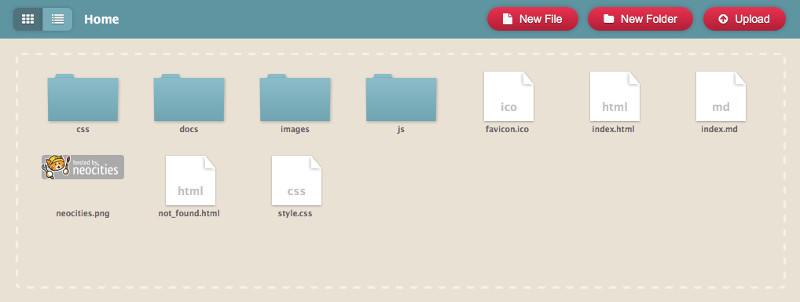

## Local install

Open the terminal and type these commands:

```
git clone https://github.com/rognoni/monastic-browser.git
cd monastic-browser/
npm install
npm run serve
```

Open your web browser at http://localhost:8080/
and type `Markdown URL` http://localhost:8080/index.md

## Manual deploy

Build the application with the command `npm run build`

```
File                                   Size              Gzipped

dist/js/chunk-vendors.1cbacf22.js      982.47 KiB        335.02 KiB
dist/js/app.5f1560d1.js                4.91 KiB          2.19 KiB
dist/css/chunk-vendors.216b7f59.css    142.76 KiB        18.65 KiB
dist/css/app.79e655fb.css              0.15 KiB          0.13 KiB
```

Copy the files on your website, for example [Neocities](https://monastic.neocities.org)


